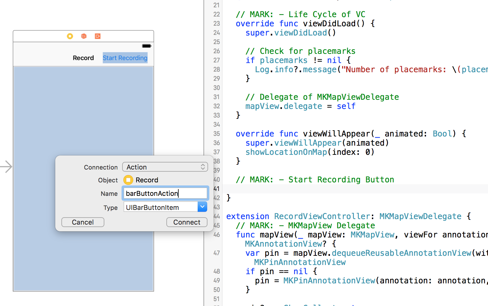
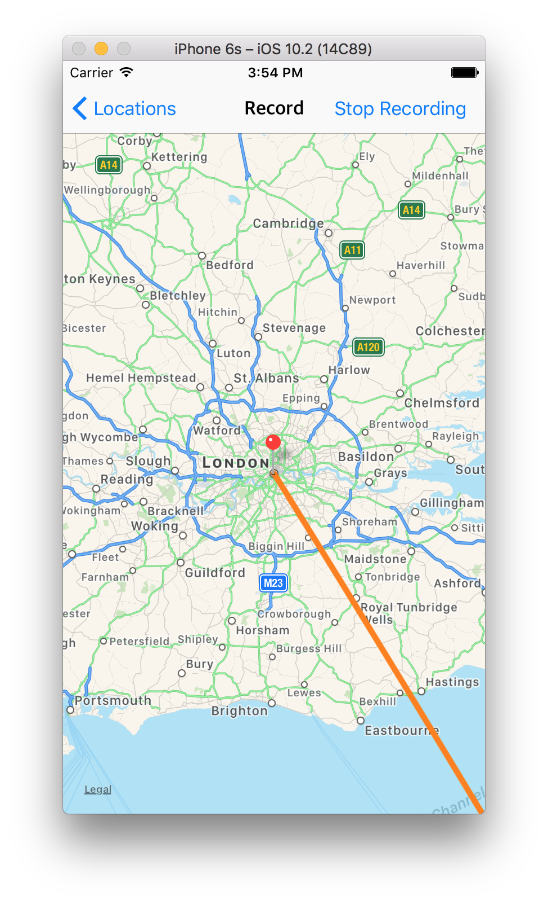
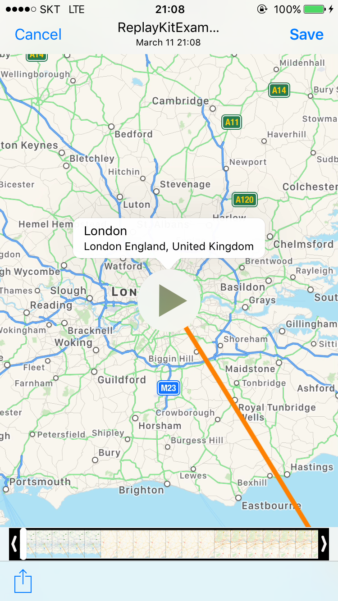

# ReplayKit을 이용해 여행 떠나기
2017-03-11

이번 포스트에서는 **ReplayKit**이라는 Framework를 이용해 스크린을 녹화하고 녹화한 영상을 공유하는 방법에 대해서 알려드리고자 합니다. ReplayKit은 [WWDC 2015 Keynote](https://developer.apple.com/videos/play/wwdc2015/101/?time=3931)에서 처음 발표가 된 Framework입니다. WWDC Keynote를 보면 ReplayKit Framework는 본래 사용자가 자신의 게임 플레이를 녹화하거나 방송을 할 수 있도록 지원하기 위해 만들어졌습니다. 그러나 꼭 게임 플레이만 녹화하라는 법이 있나요?
그래서 이번 포스트에서는 ReplayKit에서 제공하는 녹화와 방송 기능 중에서 **녹화** 기능에 대해서 알아보고, 이를 이용해 움직이는 지도를 녹화하는 간단한 예제를 작성해보고자 합니다.

### 시작하기에 앞서
여러분이 ReplayKit의 사용법을 익히실 수 있도록 초기 예제 프로젝트와 완성된 프로젝트를 [Github](https://github.com/chizcake/ReplayKitExample)에 올려놨습니다. 초기 예제 프로젝트(ReplayKitExampleStarter)를 열어 포스트에 올려놓은 방법을 따라하며 프로젝트를 완성하셔도 좋고, 완성된 프로젝트(ReplayKitExampleComplete)를 참고해서 ReplayKit의 녹화 기능이 어떻게 동작하는지 한 눈에 보셔도 좋을 것 같습니다.

### 예제 프로젝트에 대한 설명
예제 프로젝트는 다음과 같은 프로세스를 가집니다.
1. 사용자가 지도 위에 표시할 여러 개의 지역을 입력합니다.
2. 지역을 모두 입력하면, **Record** 버튼을 눌러 녹화할 수 있는 view로 이동합니다.
3. **Start Recording** 버튼을 누르면 녹화가 시작되면서 지도가 움직입니다.
(지도는 사용자가 입력한 지역 순서대로 움직이며, **3초에 한 번씩 다음 지역으로 이동**합니다.)
4. 사용자가 입력한 모든 지역을 순회하면, 녹화를 마치고 Preview controller를 통해 녹화된 영상을 확인합니다.

초기 예제 프로젝트(ReplayKitExampleStarter) 에서는 사용자가 지도 위에 표시할 **지역을 검색할 수 있는 view**와 **입력한 지역을 확인할 수 있는 view**가 구현되어 있습니다. 그리고 Record 버튼을 눌렀을 때 입력한 지역들이 지도 위에 pin으로 나타날 수 있도록 구현되어 있습니다. 이번 포스트의 취지는 ReplayKit의 사용법이므로, ReplayKit 기능 이외의 다른 기능의 설명은 생략하도록 하겠습니다. (ReplayKit 이외에 이 프로젝트에 대해서 궁금한 사항이 있으시다면 언제든 포스트 하단에 게재한 이메일로 연락주세요 :] )

> 참고로 본 예제는 MapKit을 이용해 지역을 검색하는 기능이 포함되어 있습니다. 따라서 **인터넷 접속이 가능한 환경에서 예제를 실행**해야 제대로 된 결과를 확인하실 수 있습니다. 또한 Simulator가 아닌 실제 iPhone, iPad 기기를 통해 테스트 하는 것을 권장합니다. 테스트 결과 ReplayKit이 Simulator에서 올바르게 동작하지 않는 현상이 나타나는 것을 확인하였습니다. (혹시 Simulator에서도 ReplayKit이 올바르게 동작하는 방법이 있다면 알려주시면 감사하겠습니다. :])  

### Step 1 - Start Recording 버튼 만들기
RecordViewController 우측 상단에 **Start Recording** 버튼을 만들어 줍니다. 사용자가 이 버튼을 누르면, 화면 녹화가 시작되면서 동시에 지도가 자동으로 움직일 수 있게 만들고자 합니다.
버튼을 만들고 RecordViewController에 **@IBAction**와 **@IBOutlet** 으로 연결해줍니다. Start Recording 버튼을 toggle 버튼처럼 사용하려고 합니다. 사용자가 Start Recording 버튼을 누르면 녹화가 시작되고, 버튼을 한번 더 누르면 녹화가 중지될 수 있도록 만들겠습니다. 우선 Start Recording 버튼의 target method를 다음과 같이 만듭니다.



```swift
@IBOutlet weak var barButton: UIBarButtonItem!

@IBAction func barButtonAction(_ sender: UIBarButtonItem) {
	if sender.title == "Start Recording" {
		Log.info?.message("Start Recording!")
		sender.title = "Stop Recording"
	} else if sender.title == "Stop Recording" {
		Log.info?.message("Stop Recording!")
		sender.title = "Start Recording"
	}
}
```

> 위에서 사용한 Log 클래스는 [CleanroomLogger]( https://github.com/emaloney/CleanroomLogger) 에 정의되어 있습니다. 예시 프로젝트에는 이미 Carthage로 라이브러리를 추가한 상태이므로 그대로 사용하셔도 무방하지만, CleanroomLogger가 설치되지 않은 환경에서는 NSLog 혹은 본인이 원하는 방식으로 버튼이 잘 동작하는지 확인하시면 됩니다.  

 


Target method를 다음과 같이 작성하면, 위에 보시는 것과 같이 버튼이 잘 동작하는 것을 확인하실 수 있습니다. 그럼 이제 **Start Recording** 상태일 때 버튼을 누르면 녹화가 시작되고, **Stop Recording** 상태일 때 버튼을 누르면 녹화가 중지될 수 있도록 메소드를 입력해 줍니다.

```swift
@IBAction func barButtonAction(_ sender: UIBarButtonItem) {
	if sender.title == "Start Recording" {
		...
		startRecording()
	} else if sender.title == "Stop Recording" {
		...
		stopRecording()
	}
}
```

### Step 2 - 녹화 시작하기
지금부터는 ReplayKit을 사용하기 때문에 코드 상단에 `import ReplayKit` 을 입력해야 합니다. 우선, `startRecording() `메소드를 구현해 보겠습니다. 

```swift
class RecordViewController: UIViewController {
	// MARK: - Properties
	...
	// 0. 현재 녹화 여부를 확인합니다.
	var isRecording: Bool = false
	...

	func startRecording() {
		// 1. RPScreenRecorder 공유 객체를 호출합니다.
		let recorder = RPScreenRecorder.shared()
		
		recorder.startRecording { (recordingError) in
			// 1-1. 녹화 중 에러가 발생하면 에러 메시지를 확인하고 메서드를 종료합니다.
			if let error = recordingError {
				Log.error?.message(error.localizedDescription)
				self.barButton.title = "Start Recording"
			} else {
				// 2. 녹화가 정상적으로 시작하면 지도를 자동으로 움직이게 합니다.
				self.isRecording = true
				self.startAnimatingMap()
			}
		}
	}
}
```

녹화가 시작되었을 때 지도가 움직이도록 하는 `startAnimatingMap()` 메소드와 지도가 모두 움직이고 난 후에 호출될 `stopAnimatingMap()` 메소드를 구현해 보겠습니다.

```swift
class RecordViewController: UIViewController {
	// MARK: - Properties
	...
	var timer = Timer?
	var currentLocation: Int = 0
	...

	func startAnimatingMap() {
		if currentLocation == 0 {
			showLocationOnMap(index: currentLocation)
			currentLocation += 1
		}
		
		// 3. 3초에 한 번씩 지도가 움직일 수 있도록 타이머를 설정해줍니다.
		timer = Timer.scheduledTimer(timeInterval: 3.0, target: self, selector: #selector(animatesMap), userInfo: nil, repeats: true)
	}
	
	func animatesMap() {
		if currentLocation < placemarks.count {
			// 4. timer에 맞춰 지도가 움직이게 합니다.
			showLocationOnMap(index: currentLocation)
			currentLocation += 1
		} else {
			// 4-1. 지도가 모두 움직이면 timer를 종료하고 녹화를 종료합니다.
			stopAnimatingMap()
			currentLocation = 0
		}
	}
	
	func stopAnimatingMap() {
		guard let timer = self.timer else { return }
		// 5. 타이머를 종료합니다.
		timer.invalidate()
		self.timer = nil
		self.isRecording = false
		// 6. 녹화를 종료합니다.
		stopRecording()
	}
}
```

### Step 3 - 녹화 종료하기
마지막으로 녹화가 종료될 때 호출하는 `stopRecording()` 메소드를 구현해 보겠습니다. `stopRecording()` 메소드가 호출되는 경우는 크게 두 가지가 있습니다. 첫번째는 사용자가 녹화 중간에 종료 버튼을 눌렀을 경우입니다. 두번째는 지도 위의 애니메이션이 모두 종료된 후 자동으로 녹화가 종료되는 경우입니다. 이 두가지 경우를 모두 생각하여 메소드를 구현해 보겠습니다.

```swift
func stopRecording() {
	let recorder = RPScreenRecorder.shared()
	
	if isRecording {
		// 7-1. 사용자가 녹화 중간에 녹화를 종료하는 경우
		timer?.invalidate()
		timer = nil
		currentLocation = 0
		recorder.stopRecording(handler: { (previewController, recordingError) in
			if let error = recordingError {
				Log.error?.message(error.localizedDescription)
			}
		})
	} else {
		// 7-2. 지도가 모두 움직이고, 정상적으로 녹화를 종료하는 경우
		recorder.stopRecording(handler: { (previewController, recordingError) in
			if let error = recordingError {
				Log.error?.message(error.localizedDescription)
			} else {
				// 7-3. 녹화 결과를 확인할 PreviewViewController를 Modal로 보여줍니다.
				if let controller = previewController {
					self.present(controller, animated: true, completion: nil)
				}
			}
		})
	}
	barButton.title = "Start Recording"
}
```

### Step 4 - PreviewViewController로 녹화 영상 확인하기
여기까지 잘 따라오셨다면 지도 위에서의 animation이 모두 완료되었을 때 ReplayKit에서 제공하는 PreviewViewController가 Modal로 뜨게 됩니다. PreviewViewController에서는 녹화한 동영상을 저장하거나 공유할 수 있습니다. 또한 특정 영역을 따로 잘라내 저장하는 기능도 갖추고 있습니다. 그럼 마지막으로 RPPreviewViewControllerDelegate를 사용해서 PreviewViewController에서 화면을 처리하는 방법을 구현해 보겠습니다.

```swift
extension RecordViewController: RPPreviewViewControllerDelegate {
	func previewControllerDidFinish(_ previewController: RPPreviewViewController) {
		// 8. PreviewViewController에서 작업이 끝나면 화면을 MasterViewController로 이동시킵니다.
		previewController.dismiss(animated: true) { 
			let _ = self.navigationController?.popViewController(animated: true)
		}
	}
}
```

위의 코드를 모두 입력하시고 빌드 후에 애플리케이션을 테스트 해보세요. 지도 애니메이션이 모두 끝나면 녹화가 종료되면서 자동으로 PreviewViewController가 뜨는 것을 확인하실 수 있습니다.



###  Step 5 - 녹화 화면 다듬기
이제 모든 작업이 다 끝났습니다. 여러분은 본인이 입력한 지역에 따라 자동으로 움직이는 지도를 녹화하는 애플리케이션을 만들었습니다. 그런데 한가지 아쉬운 점이 있네요. 여러분이 녹화한 화면을 유심히 보셨다면, 화면 위의 Navigation Bar가 그대로 노출이 되어있는 것을 볼 수 있을겁니다. **ReplayKit은 현재 스크린을 통째로 녹화**하기 때문에 원하지 않는 부분은 녹화가 시작되기 전에 숨겨야 합니다. 그럼 지금부터 녹화가 시작될 때 Navigation Bar를 숨기는 부분을 구현해 보겠습니다.

```swift
class RecordViewController: UIViewController {
	// MARK: - Properties
	...
	// 9. 녹화가 시작되면 Status bar를 감춥니다.
	override var prefersStatusBarHidden: Bool {
		return (self.navigationController?.isNavigationBarHidden)!
	}

	...
	func startRecording() {
		...
		// 10. 녹화가 시작되면 Navigation Bar를 숨겨줍니다.
		self.navigationController?.isNavigationBarHidden = true
		...
	}

	func stopRecording() {
		...
		// 11. 녹화가 종료되면 Navigation Bar를 원상태로 복구합니다.
		self.navigationController?.isNavigationBarHidden = false
	}
}
```

위의 작업이 끝났다면, 이제 지도만 녹화가 된 것을 확인하실 수 있습니다 :)


### 마치며
지금까지 ReplayKit의 녹화 기능에 대해서 간단하게 살펴 보았습니다. RPScreenRecorder를 사용하면 간단하게 현재 스크린을 녹화할 수 있으며, 녹화한 결과는 RPPreviewViewController를 이용해 다양하게 사용할 수 있다는 것을 확인해 보았습니다.
프로젝트의 좀 더 자세한 구현 내용은 앞서 올려드린 [Github](https://github.com/chizcake/ReplayKitExample)의 ReplayKitExampleComplete를 통해 확인해 볼 수 있습니다. 본 포스트에 대한 제안 사항이나 궁금하신 점이 있다면 언제든 연락 주시면 감사하겠습니다.

작성자: [유준영](https://github.com/chizcake)
Email: woody.chiz@gmail.com
